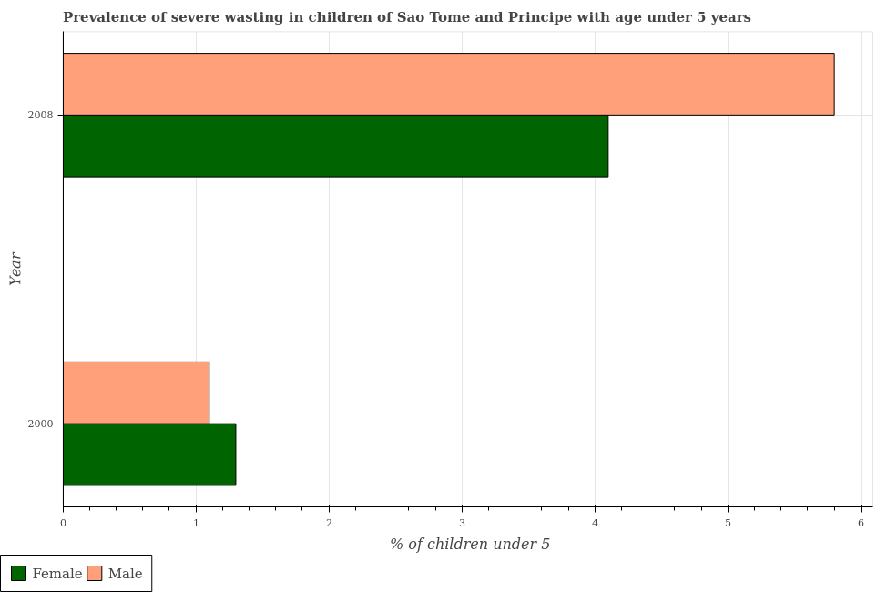
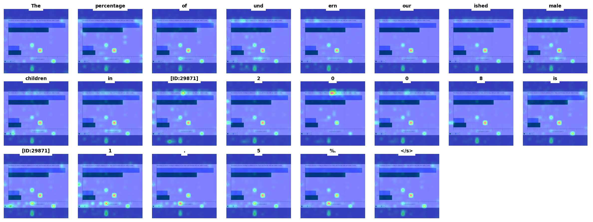

## VLM-Attn: Attention-based Visual Explanations for Chart-QA Vision-Language Models

Code for generating and evaluating attention-based visual explanations (heatmaps) for
vision-language models answering questions about charts.

Refactored from the original notebook (`test.ipynb`) into a single runnable script,
`llava_attention_demo.py`. All functions are preserved as-is (same logic, same math),
the only changes are:

- organizing the code into functions/CLI subcommands instead of top-to-bottom cells
- adding `argparse` so paths/params are passed as flags instead of hardcoded
- guarding heavy imports so `--help` works without the ML stack installed

Example input chart and the resulting per-generated-token attention heatmap grid:




### ⚠️ Before this will run

Two dependencies are used but not defined inside the script itself, they need to be
made importable next to it:

1. **The `llava` package**, from [haotian-liu/LLaVA][2]. Clone it and either:
   - `pip install -e .` from inside the cloned repo, or
   - put the repo's `llava/` folder on your `PYTHONPATH` / next to this script (the
     original notebook did `sys.path.append("./models")`, so a `models/llava/...`
     layout also works, just adjust `sys.path` at the top of
     `llava_attention_demo.py` if you use that layout)

2. **`utils.py`**, providing `load_image`, `aggregate_llm_attention`,
   `aggregate_vit_attention`, `heterogenous_stack`, `show_mask_on_image`. Copy it into
   this same folder (or add its location to `PYTHONPATH`). Only the `batch`
   subcommand needs it.

Without these two, `sensitivity` will fail at the `from llava...` imports, and `batch`
will fail at both the `llava` and `utils` imports. `metrics` needs neither, it's pure
numpy.

### Requirements

```bash
pip install -r requirements.txt
# then clone + install LLaVA as described above
```

`requirements.txt` pins `numpy==1.26.4` (folded in from the notebook's
uninstall/reinstall cells, to avoid `numpy`/`opencv` ABI conflicts) alongside
`accelerate`, `einops`, `huggingface_hub`, `jsonlines`, `rich`, `sentencepiece`,
`timm==0.9.10`, `transformers>=4.38.1`, `opencv-python`, `seaborn`, and `matplotlib`.

A CUDA GPU is effectively required, the code loads the 7B model in fp16. CPU-only
execution is unsupported by the underlying LLaVA loading code as written.

### Usage

#### Input-noise sensitivity test (single image)

```bash
python demo.py sensitivity \
    --model-path liuhaotian/llava-v1.5-7b \
    --image path/to/image.png \
    --question "What is shown in this chart?" \
    --noise-levels 0.05 0.10 0.15 0.20 \
    --output input_sensitivity.png
```

Runs the model once on the clean image, then again at each noise level, and plots how
similar the attention heatmap stays as noise increases.

##### Options

- `model_path`: HuggingFace repo id for the LLaVA checkpoint. Default is `liuhaotian/llava-v1.5-7b`
- `image`: Path to the input chart image
- `question`: Prompt/question to ask about the image
- `noise_levels`: Gaussian noise standard deviations (as a fraction of the pixel range) to test at. Default is `0.05 0.10 0.15 0.20`
- `output`: Path to save the resulting similarity plot. Default is `input_sensitivity.png`

##### Result categories

- **Robust** (avg. similarity > 0.85): saliency is stable to input perturbations
- **Moderate** (0.5–0.85): saliency changes somewhat with input noise, typical for real applications
- **Sensitive** (< 0.5): saliency is highly affected by input noise, may not be trustworthy for interpretation

#### Batch attention visualization over a QA dataset

```bash
python llava_attention_demo.py batch \
    --model-path liuhaotian/llava-v1.5-7b \
    --qapairs-path image_indices.json \
    --images-dir pngval/png/png \
    --output-dir lava_out_attn \
    --num-questions 50
```

##### Options

- `model_path`: HuggingFace repo id for the LLaVA checkpoint. Default is `liuhaotian/llava-v1.5-7b`
- `qapairs_path`: JSON file of `{image_index, question_string, type, answer}` entries
- `images_dir`: Directory holding `{image_index}.png` files referenced by `qapairs_path`
- `output_dir`: Where per-question attention-overlay SVGs are saved (named `{chart_type}_{image_index}.svg`). Default is `lava_out_attn`
- `num_questions`: How many entries from `qapairs_path` to process. Default is `50`
- `--run-saliency-metrics`: Also print the sparsity/minimality diagnostics (see below) for every question's saliency maps
- `--heatmap-only`: Save the raw heatmap instead of the image+heatmap overlay

For each entry, loads `{images_dir}/{image_index}.png`, runs generation, and produces
one heatmap panel per generated answer token.

#### Sparsity / minimality diagnostics on saved saliency maps

If saliency maps have already been saved as `.npy` files (e.g. via
`np.save(f"token_{i}.npy", attn_over_image.cpu().numpy())`), the diagnostics can be run
standalone, no model or GPU needed:

```bash
python llava_attention_demo.py metrics token_0.npy token_1.npy token_2.npy
```

##### Metrics

- `sparsity_entropy`: Lower = more sparse
- `sparsity_maxmin`: Higher = more sparse
- `get_saliency_ratio`: Relative attention mass between two user-defined image regions (e.g. plot area vs. legend)

### What changed vs. the notebook, functionally

Nothing, the math in every function (`load_pretrained_model1`,
`add_noise_to_image`, `get_heatmap_from_attention`, `compute_heatmap_distance`, the
sparsity/minimality metrics, the attention aggregation loop) is copied verbatim from
the notebook cells, just wrapped in functions and given a CLI. The `!pip install ...`
cells became `requirements.txt`. The two cells that uninstalled/reinstalled
numpy/opencv were folded into a pinned `numpy==1.26.4` in `requirements.txt` rather
than kept as a runtime `pip uninstall` step.

### License

BSD

#### 3rd-party

- [LLaVA][2] (`liuhaotian/llava-v1.5-7b`)

[2]: https://github.com/haotian-liu/LLaVA


